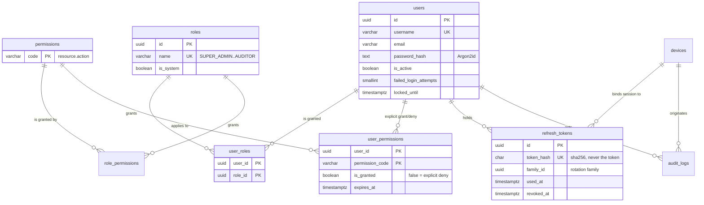
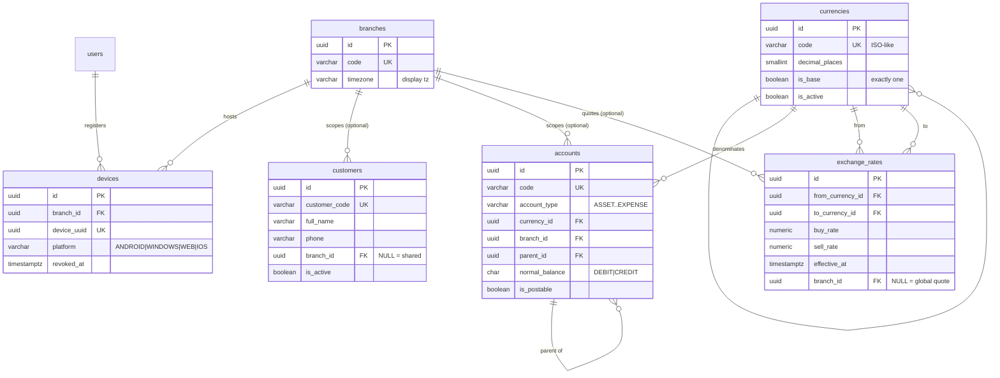
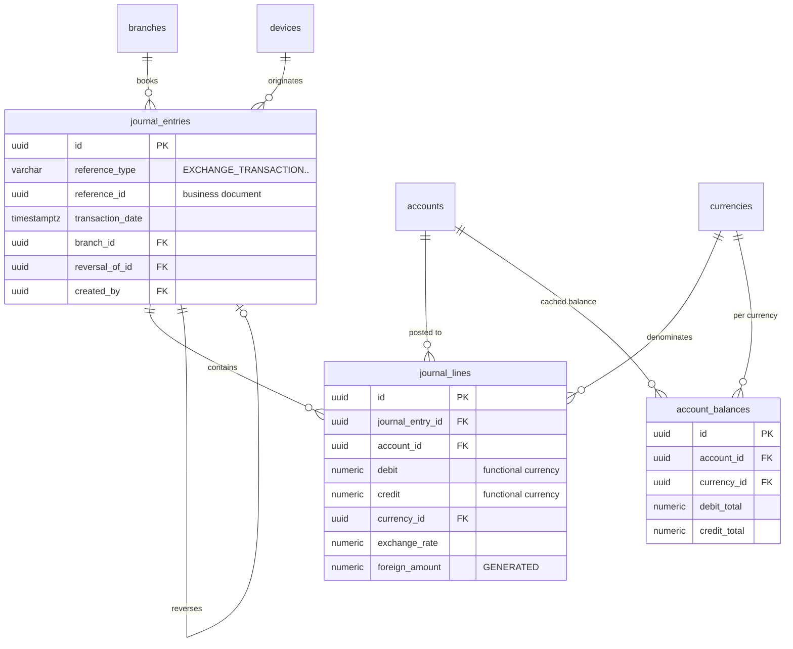
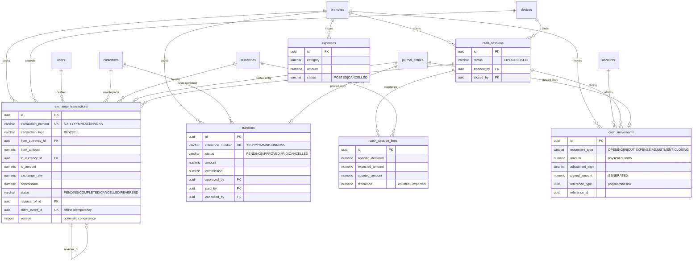
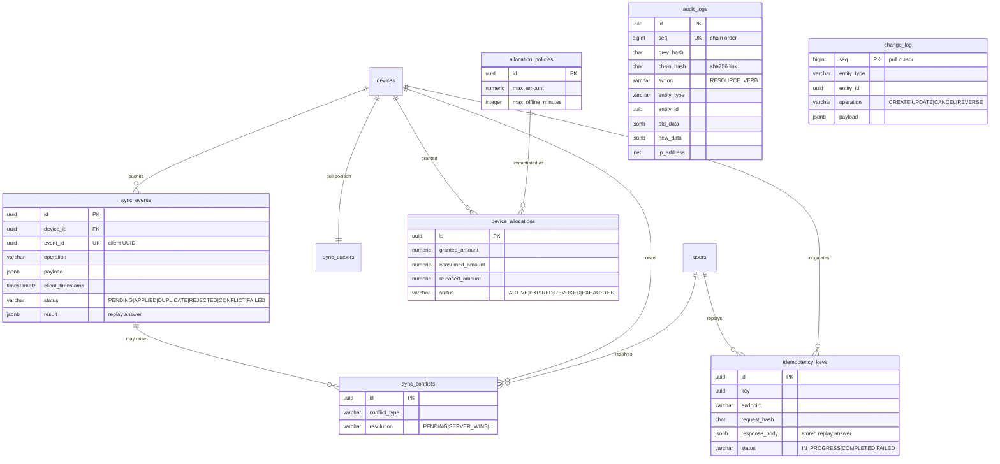

# NEXUS EXCHANGE ERP — Entity Relationship Model

| Field | Value |
| --- | --- |
| Document ID | `DB-ERD-001` |
| Version | 1.0 (Phase 0) |
| Status | **Proposed — pending Phase 0 approval** |
| Database | `nexus_exchange` (PostgreSQL 16, UTC) |
| Source of truth | `docs/database/schema.sql` (executable, verified on PostgreSQL 16.2) |

> **خلاصه فارسی** — این سند مدل داده و روابط بین ۳۱ جدول را نشان می‌دهد: هویت و دسترسی، سازمان (شعبه/دستگاه)، داده‌های پایه (ارز/مشتری/حساب)، هسته حسابداری (سند/ردیف)، معاملات (خرید و فروش ارز، حواله، صندوق، هزینه)، ممیزی و همگام‌سازی آفلاین. نکته کلیدی: `journal_lines` منبع حقیقت است و `account_balances` فقط یک کش قابل بازسازی است.

---

## 1. Domain map

```text
┌──────────────────────┐   ┌───────────────────────┐   ┌──────────────────────┐
│  IDENTITY & ACCESS   │   │     ORGANISATION      │   │      MASTER DATA     │
│  users               │──▶│  branches             │◀──│  currencies          │
│  roles               │   │  devices              │   │  customers           │
│  permissions         │   └───────────┬───────────┘   │  accounts            │
│  refresh_tokens      │               │               │  exchange_rates      │
└──────────┬───────────┘               │               └──────────┬───────────┘
           │                           │                          │
           ▼                           ▼                          ▼
┌─────────────────────────────────────────────────────────────────────────────┐
│                            ACCOUNTING CORE                                  │
│   journal_entries ──▶ journal_lines ──▶ accounts / currencies               │
│                             │                                               │
│                             └──▶ account_balances  (rebuildable cache)       │
└──────────┬──────────────────────────────────────────────────────────────────┘
           │ posted from
           ▼
┌─────────────────────────────────────────────────────────────────────────────┐
│                              TRANSACTIONS                                   │
│  exchange_transactions        transfers        cash_movements + cash_sessions│
│  expenses                                                                   │
└──────────┬──────────────────────────────────────────────────────────────────┘
           │ emitted to
           ▼
┌───────────────────────────┐   ┌────────────────────────────────────────────┐
│         AUDIT             │   │        OFFLINE SYNC & CONTROL              │
│  audit_logs (hash chain)  │   │  sync_events, sync_conflicts, sync_cursors │
│  change_log (pull feed)   │   │  allocation_policies, device_allocations   │
└───────────────────────────┘   │  idempotency_keys, sequences               │
                                └────────────────────────────────────────────┘
```

## 2. Identity and access



## 3. Organisation and master data



## 4. Accounting core



Ledger rules: `journal_lines` is append-only; one entry per `(reference_type, reference_id)`; an entry may be reversed at most once; `SUM(debit) = SUM(credit)` is checked at COMMIT. `account_balances` is a cache that `rebuild_account_balances()` reproduces exactly.

## 5. Transactions



## 6. Audit, offline sync and control



## 7. Relationship catalogue

| Child | Parent | Cardinality | On delete | Rationale |
| --- | --- | --- | --- | --- |
| `user_roles.user_id` | `users.id` | N:1 | CASCADE | Pure join row |
| `user_roles.role_id` | `roles.id` | N:1 | CASCADE | Pure join row |
| `role_permissions.role_id` | `roles.id` | N:1 | CASCADE | Permission catalogue is code-owned |
| `role_permissions.permission_code` | `permissions.code` | N:1 | RESTRICT | A permission in use cannot vanish |
| `user_permissions.user_id` | `users.id` | N:1 | CASCADE | Grant/deny row |
| `refresh_tokens.user_id` | `users.id` | N:1 | CASCADE | Sessions die with the user row |
| `refresh_tokens.device_id` | `devices.id` | N:1 | (none) | Device revocation is enforced in the service, not by cascading |
| `devices.branch_id` | `branches.id` | N:1 | RESTRICT | A branch with devices cannot be removed |
| `devices.registered_by` / `revoked_by` | `users.id` | N:1 | RESTRICT | Attribution must survive |
| `customers.branch_id` | `branches.id` | N:1 | RESTRICT | NULL = shared customer |
| `accounts.currency_id` | `currencies.id` | N:1 | RESTRICT | Currency of the account |
| `accounts.branch_id` | `branches.id` | N:1 | RESTRICT | NULL = group-level account |
| `accounts.parent_id` | `accounts.id` | N:1 | RESTRICT | Chart tree |
| `exchange_rates.from_currency_id` / `to_currency_id` | `currencies.id` | N:1 | RESTRICT | Quotes reference live currencies |
| `journal_entries.reference_id` | business document | polymorphic | (none) | Soft link; integrity by `reference_type` CHECK + service |
| `journal_entries.reversal_of_id` | `journal_entries.id` | N:1 unique | (none) | At most one reversal per entry |
| `journal_lines.journal_entry_id` | `journal_entries.id` | N:1 | RESTRICT | Ledger rows are never orphaned |
| `journal_lines.account_id` | `accounts.id` | N:1 | RESTRICT | Posting target |
| `journal_lines.currency_id` | `currencies.id` | N:1 | RESTRICT | Mandatory currency context (deviation D-09) |
| `account_balances.account_id` + `currency_id` | `accounts.id`, `currencies.id` | 1:1 pair | RESTRICT | Cache key |
| `exchange_transactions.branch_id`, `cashier_id`, `device_id`, `customer_id` | branches/users/devices/customers | N:1 | RESTRICT | Attribution of a financial event |
| `exchange_transactions.cash_session_id` | `cash_sessions.id` | N:1 | (none) | Shift grouping |
| `exchange_transactions.reversal_of_id` | `exchange_transactions.id` | N:1 unique | (none) | Single reversal |
| `transfers.*` lifecycle actors | `users.id` | N:1 | RESTRICT | Who approved/paid/cancelled |
| `cash_sessions.branch_id`, `opened_by`, `closed_by` | branches/users | N:1 | RESTRICT | Shift attribution |
| `cash_session_lines.cash_session_id` | `cash_sessions.id` | N:1 | CASCADE | A draft shift's lines vanish with it (only while OPEN) |
| `cash_movements.*` | branches/accounts/currencies/sessions | N:1 | RESTRICT | Immutable movement rows |
| `expenses.branch_id`, `currency_id`, `created_by` | branches/currencies/users | N:1 | RESTRICT | Expense attribution |
| `audit_logs.user_id`, `device_id` | users/devices | N:1 | RESTRICT | An audit row may never lose its actor |
| `sync_events.device_id` | `devices.id` | N:1 | RESTRICT | Events belong to a device |
| `sync_conflicts.device_id`, `sync_event_id`, `resolved_by` | devices/sync_events/users | N:1 | RESTRICT | Conflict provenance |
| `sync_cursors.device_id` | `devices.id` | 1:1 | CASCADE | Cursor is device state |
| `device_allocations.device_id`, `policy_id` | devices/allocation_policies | N:1 | RESTRICT | Granted allowance provenance |
| `idempotency_keys.user_id`, `device_id` | users/devices | N:1 | RESTRICT | Replay scoping |

## 8. Index strategy (why each index exists)

| Access pattern | Index |
| --- | --- |
| Latest quote for a pair (exchange screen, every sale) | `ix_exchange_rates_pair_effective (from, to, effective_at DESC)` |
| Duplicate-quote prevention | `ux_exchange_rates_no_duplicate_instant` |
| Cashier shift / daily report by branch | `ix_exchange_transactions_branch_created`, `ix_exchange_transactions_cashier_created` |
| Customer statement | `ix_exchange_transactions_customer`, `ix_transfers_customer`, `ix_customers_phone` |
| Pending offline rows to reconcile | `ix_exchange_transactions_origin_pending` (partial) |
| Ledger drill-down | `ix_journal_lines_entry`, `ix_journal_lines_account`, `ix_journal_entries_date` |
| Trial balance by branch/date | `ix_journal_entries_branch_date` |
| Cash position / movement history | `ix_cash_movements_branch_currency`, `ix_cash_movements_session` |
| Audit investigation | `ix_audit_logs_entity`, `ix_audit_logs_action`, `ix_audit_logs_user` |
| Offline pull | `ix_change_log_occurred`, `ix_change_log_entity`, `ix_sync_cursors` PK |
| Conflicting offline events queue | `ix_sync_conflicts_pending` (partial), `ix_sync_events_device_status` |
| Name search on the counter | `ix_customers_full_name` (Phase 12 adds a `pg_trgm` GIN index where contrib is available) |

## 9. Data volume assumptions (planning baseline)

| Table | Rows/year (single branch, 300 tx/day) | Retention |
| --- | --- | --- |
| `exchange_transactions` | ~90,000 | 10 years |
| `journal_entries` / `journal_lines` | ~90,000 / ~300,000 | 10 years (legal) |
| `cash_movements` | ~200,000 | 10 years |
| `audit_logs` | ~1,000,000 | 10 years, monthly partitions planned (Phase 12) |
| `change_log` | ~1,000,000 | 180 days, then pruned by a maintenance task |
| `sync_events` | ~90,000 | 2 years |

Partitioning (`audit_logs`, `change_log`, `sync_events`, `journal_lines` by month) is a Phase 12 migration; the primary keys and access paths above are already partition-compatible (`seq`/`created_at` predicates).

## 10. Traceability

| Master prompt | Section |
| --- | --- |
| PART 6–19 | §2–§6 (entities) |
| PART 11, PART 12 | §4 |
| PART 18 | §6 (hash chain columns) |
| PART 19, PART 34 | §6 (sync state machine) |
| PART 37 | §6 (`allocation_policies`, `device_allocations`) |
| PART 40 | §6 (`idempotency_keys`) |
